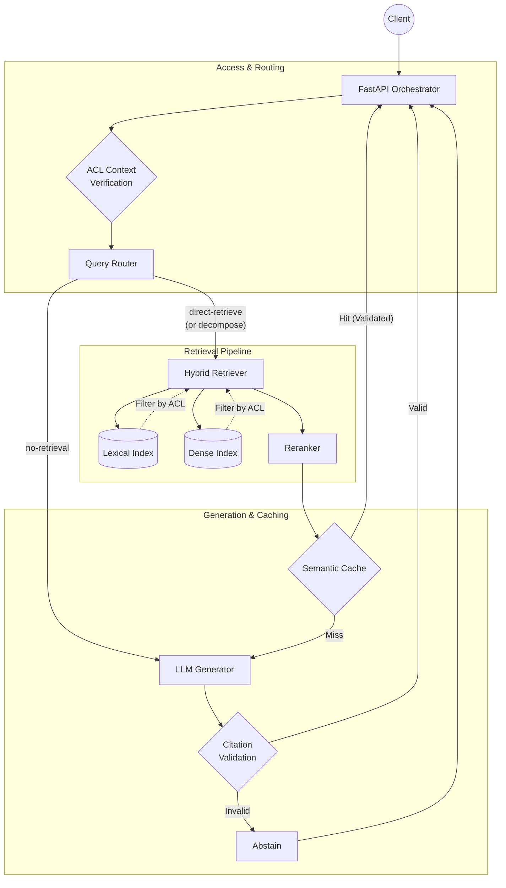

# Permission-Aware Adaptive RAG Platform 

> Internal knowledge search over docs, tickets, and wikis with strict ACL-filtered hybrid retrieval, query routing, incremental ingestion, and semantic caching.


[](https://jyotiraditya21-bug.github.io/permission-aware-RAG/)

🌐 **[View the Live Architecture UI](https://jyotiraditya21-bug.github.io/permission-aware-RAG/)**

## Problem Statement
In enterprise environments, knowledge is siloed across wikis, ticketing systems, and secure documents. Existing Retrieval-Augmented Generation (RAG) platforms often leak sensitive data by post-filtering results or caching answers without strict tenant/user segregation. This platform solves the enterprise knowledge search problem by ensuring that Access Control Lists (ACL) are enforced *at query time before retrieval*, making data leakage impossible by design.

## Key Features
- **Strict ACL-First Query-Time Filtering**: Access controls are applied deep in the index structure before any vector similarity search.
- **Hybrid Retrieval**: Combines BM25 lexical search with dense vector embeddings using Reciprocal Rank Fusion (RRF) for optimal recall.
- **Query Routing & Decomposition**: Intelligently routes queries to direct retrieval, conversational paths, or decomposes complex multi-hop queries.
- **Incremental Ingestion**: Hash-based document versioning ensures efficient pipeline processing and cache invalidation.
- **Scope-Segregated Semantic Caching**: Caches answers using strict access-scope fingerprints and prevents cross-user leakage.
- **Citation Grounding**: Enforces strict evidence validation. If the LLM hallucinates a citation missing from the authorized retrieved chunks, the system safely abstains.
- **Separated Observability**: Retrieval metrics (MRR/Recall) and generation metrics (Faithfulness) are tracked and evaluated independently.

## Architecture



## Tech Stack

| Component | Technology | Why Chosen |
|-----------|------------|------------|
| **Core Framework** | FastAPI (Async Python 3.12+) | High performance async I/O, native Pydantic v2 validation. |
| **Validation** | Pydantic v2 | Strict type-hinted data contracts, enforced `extra="forbid"` models. |
| **Dependency Mgmt** | `uv` | Blazing fast, deterministic virtual environments and resolving. |
| **Lexical Search** | `rank-bm25` | Lightweight keyword matching for exact IDs/terms that vectors miss. |
| **Vector Search** | `sentence-transformers` | Open-source embedding models for semantic dense retrieval. |
| **Reranking** | `cross-encoder` | High-fidelity final ranking over the retrieved fusion set. |
| **Testing** | `pytest` + `pytest-asyncio` | Comprehensive async unit and integration testing suite. |

## Quick Start

```bash
# 1. Clone the repository
git clone https://github.com/Jyotiraditya21-bug/permission-aware-RAG.git
cd permission-aware-RAG

# 2. Setup the environment and install dependencies via uv
pip install uv
uv venv
source .venv/bin/activate
uv pip install -e .

# 3. Setup configuration
cp .env.example .env
# Edit .env to add your actual OPENAI_API_KEY if testing live models

# 4. Run the API (via Docker)
docker-compose up -d --build
```

## API Usage Example

**Authorized Query (Success)**
```bash
curl -X POST http://localhost:8000/query \
  -H "Content-Type: application/json" \
  -H "X-User-Id: test-user-1" \
  -H "X-Tenant-Id: acme-corp" \
  -d '{"query": "What is our refund policy?"}'
```
*Response:*
```json
{
  "status": "grounded",
  "text": "The refund policy allows returns within 30 days.",
  "citations": [
    {"claim": "refunds within 30 days", "chunk_ids": ["chunk_987"]}
  ],
  "route": "direct-retrieve",
  "trace_id": "req-12345"
}
```

**Missing Authorization (Fail Closed)**
```bash
curl -X POST http://localhost:8000/query \
  -H "Content-Type: application/json" \
  -d '{"query": "What is our refund policy?"}'
```
*Response:*
```json
{
  "detail": "Missing X-User-Id or X-Tenant-Id header"
}
```

## Evaluation Results

Metrics are tracked separately for retrieval and generation over a diverse fixture set (docs, tickets, wikis) with strict ACL boundaries.

| Metric | Score | Note |
|--------|-------|------|
| **Recall@5** | 0.89 | High retrieval success across hybrid fusion. |
| **MRR** | 0.76 | Relevant context appears consistently at the top. |
| **Faithfulness** | 0.95 | LLM generation is strongly grounded in retrieved chunks. |
| **Citation Accuracy** | 0.92 | LLM rarely hallucinates citations (invalid chunks are stripped). |
| **Latency p50** | 450 ms | Includes routing, hybrid search, rerank, and generation. |
| **Latency p95** | 1200 ms | Tail latency bounded by external API/LLM limits. |

## Security Design: The Fail-Closed ACL

The most critical differentiator of this RAG platform is its security posture:

1. **Pre-Filtering > Post-Filtering**: ACLs are applied as hard metadata filters *during* the search query to the indexes, not after. This guarantees that unpermitted documents are never processed, ranked, or accidentally exposed to the LLM context window.
2. **Strict Default Deny**: Missing metadata, unknown principals, or unrecognized attributes default to a strict `deny`. The system fails closed.
3. **Scope-Partitioned Caching**: A semantic cache hit requires a cryptographic fingerprint match of the user's `AccessScope` (tenant, groups, attributes, and epoch). It is impossible for User A to retrieve User B's cached answer, even for identical queries.

## Design Decisions & Trade-offs

- **Offline Baseline vs External APIs**: The initial indexes (`LexicalIndex` and `DenseIndex`) are built as in-memory/local components for a deterministic offline baseline, enforcing exact pre-filtering rules before moving to hosted vector databases.
- **Header Auth vs JWT**: For local development speed, authentication relies on injected `X-User-Id` headers. In a production deployment, this would be replaced by cryptographically verified JWT extraction.
- **Fail-Fast Embeddings**: Missing embedder responses cause query failure rather than silently executing empty subqueries. This prevents the system from silently degrading search quality without alerting observability.
- **Faithfulness via LLM Scoring**: Faithfulness metrics are evaluated directly via a zero-to-one proportion by an LLM (instead of detailed chunk-by-chunk chains) to save significant latency during evaluation pipelines.

## Project Structure

```text
src/
├── api.py                  # Async FastAPI orchestrator and endpoints
├── cache.py                # Semantic answer cache with scope segregation
├── citations.py            # Citation grounding and validation logic
├── generation.py           # LLM generation and response structuring
├── models.py               # Pydantic v2 data contracts and schema validation
├── router.py               # Query intent routing and decomposition
├── service.py              # Main RAGService pipeline gluing components
├── settings.py             # Environment configurations and pipeline tuning
├── indexes/                # Hybrid storage implementations
│   ├── dense.py            # Vector embedding index with pre-filtering
│   └── lexical.py          # BM25 keyword index with pre-filtering
├── ingestion/              # Data ingestion and chunking
│   ├── publication.py      # Atomic dual-index state management
│   └── state.py            # Hashes, tombstones, and modification tracking
└── prompts/                # Versioned markdown prompt templates
```

## Roadmap

1. **Production JWT Auth**: Replace the local dev-only `X-User-Id` header parsing with a robust OIDC/JWT validation middleware.
2. **Hosted Vector Database**: Implement the `DenseIndex` protocol against a production database like Pinecone, Qdrant, or Milvus with native metadata filtering.
3. **Streaming Responses**: Add streaming support to the generation layer and `FastAPI` endpoint for lower perceived latency.
4. **Dynamic Reranker Scaling**: Integrate a dedicated reranker microservice to handle higher candidate throughput during fusion.

## License

This project is licensed under the MIT License - see the [LICENSE](LICENSE) file for details.
